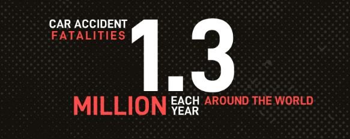

# Team 3°

Road accidents are the new ‘epidemic’ sweeping across much of the developing world. Road accident is most unwanted thing to happen to a road user, though they happen quite often. The most unfortunate thing is that we don't learn from our mistakes on road. Most of the road users are quite well aware of the general rules and safety measures while using roads but it is only the laxity on part of road users, which cause accidents and crashes. Main cause of accidents and crashes are due to human errors.

* Over Speeding.
* Drunken Driving
* Distractions to Driver
* Red Light Jumping
* Avoiding Safety Gears like Seat belts and
* Etc.

## Key facts
* Approximately 1.35 million people die each year as a result of road traffic crashes.
* The 2030 Agenda for Sustainable Development has set an ambitious target of halving the global number of deaths and injuries from road traffic crashes by 2020.
* Road traffic crashes cost most countries 3% of their gross domestic product.
* More than half of all road traffic deaths are among vulnerable road users:
  - pedestrians
  - cyclists
  - motorcyclists.
* 93% of the world's fatalities on the roads occur in low- and middle-income countries, even though these countries have approximately 60% of the world's vehicles.

Behavior		|Number		|	Percent
:---			|	---:	|	---:
Driving too fast for conditions or in excess of posted limit or racing	|	8,596	| 16.7
Under the influence od alcohol, drugs or medication	|	5,175	|	10.1
Failure to keep in proper lane	|	3,706	|	7.2
Failure to yield right of way	|	3,579	|	7.0
Distracted (phone, talking, eating. object etc.)| 2,688	|	5.2
Operating vehicle in a careless manner	|	2,797	|	5.4
Failure to obey Traffic signs, signals or officer	|1,990	|3.9
Operating vehicle in erratic, reckless or negligent manner|1,955|3.8
Overcorrecting/oversteering	|	1,617	|	3.1
Vision obscured (rain, snow, glare, building, trees, etc.)|1,540|3.0
Driving wrong way on one-way traffic or wrong side of road|1,243|2.4
Drowsy, asleep, fatigued, ill, or blacked out|	1.221|	1.4
Swerving or avoiding due to wind, slippery surface etc.|	1,176|2.3
Making improper turn		|	635		|	1.2
Other factors			|	5,203	|	10.1
None reported			|	9,167	|	17.8
Unknown					|	16,012	|	31.1

* Road traffic injuries are the leading cause of death for children and young adults aged 5- 29 years.  

Year|Killed|Injured
:--:|:---:|:---:
2016|37,461|3,144
2017|40,100|2,116
2018|33,654|1,894
2019|42,334|2,434

Source: [**WHO**](https://www.who.int/news-room/fact-sheets/detail/road-traffic-injuries)

## Most common causes of road accident
#### Distracted Driving
One of the most leading causes of road accidents is distracted driving. The number of accidents occurring due to distracted driving has increased in the past decades. Undivided attention while driving is a must and drivers should inculcate the same within them. Reading messages, replying to texts, taking calls, reading, grooming, etc. behind the wheel can be fatal.  

#### Drunk Driving
Drunk driving or driving under the influence of any drug is one of the most dangerous causes of road crashes. If you have had a drink or anything, take a cab or give your keys to a sober friend who can drop you home. Driving in a drunken condition is not worth the risk.
#### Speeding/ Reckless Driving
It is quite tempting to push the accelerator and increase the speed when you are running late. Speeding increases the intensity of accidents and is proved to be fatal most of the time. Hence, it is advisable to drive within the legal limits even when you are running late. Reckless driving mostly leads to horrible accidents. Take your time and remain calm behind the wheels
to avoid unwanted accidents caused by mere neglect 
#### Not Wearing Seat Belt
It is essential to wear a seat belt while driving. Not only it keeps your posture right, but also reduces the chances of injuries during a head to head collision. It also increases the likelihood of survival of the drivers without having to suffer any significant damage.
#### Rain or Wet Roads
Wet roads are slippery, and hence they can be fatal for the vehicles as the wheels lose their traction on wet roads. While you can't always avoid driving in the rain, the slippery streets should be best avoided whenever possible. Also, when the visibility is too low, you should pull over and wait until the rain subsides.
#### Breaking Traffic Rules
If everyone follows the traffic rule, the roads will be a safer place to be. The rules are simple, yet few people tend to break them often. Red signal always means stop. Even if you see no other vehicles coming, running a red light and breaking the law might cause a severe accident. Understand that life is more important than all excuses combined, and it's best to be safe than sorry.

(According to police officers, mobile phone use is under-reported in traffic accident records).  

  

#### Over speed
* An increase in average speed is directly related both to the likelihood of a crash occurring and
to the severity of the consequences of the crash.
> For example, every 1% increase in mean speed
produces a 4% increase in the fatal crash risk and a 3% increase in the serious crash risk. The death risk for pedestrians hit by car fronts rises rapidly (4.5 times from 50 km/h to 65 km/h).
* In car-to-car side impacts the fatality risk for car occupants is 85% at 65 km/h.
